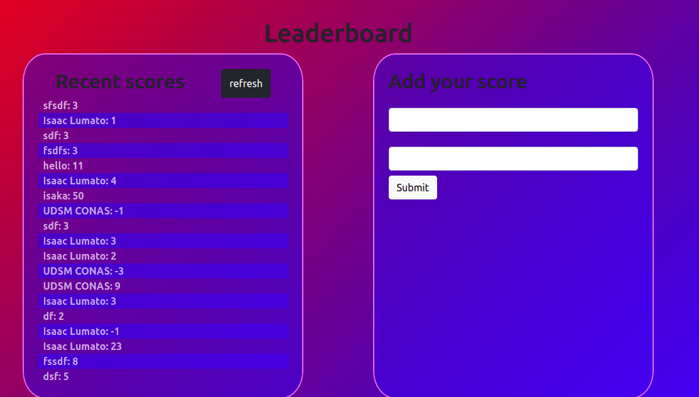

# To-Do List

> This project is focused towards building a to-do list. Objective of this project is to understand 
- Webpack to bundle JavaScript
- ES6 Syntax
- Writing modular JS

Additional description about the project and its features.

## Built With

- Major languages:
1. ES6/JavaScript
2. HTML
3. CSS
- Technologies used:
1. Git
2. GitHub
3. VS Code

## Live Demo

[Live Demo Link](https://isaka-lumato.github.io/leaderboards/)

## Getting Started

To get a local copy up and running follow these simple example steps.

Clone the repo with `git clone https://github.com/isaka-lumato/leaderboards.git`

Type `cd leaderboards` on the terminal to access the project 

Run npm i to install the dependencies

Run npm start to start the application

Run `npx hint .` to test for html linting check

Run `npx stylelint "**/*.{css,scss}"` to test for css linting check

The app is deployed using GitHub pages. You can view it using the 'live demo' above.

## Authors

👤 **isaac lumato**

- GitHub: [@isaka-lumato](https://github.com/isaka-lumato)
- LinkedIn: [@isaka-lumato](https://www.linkedin.com/in/isaka-william-90773020b/)

## 🤝 Contributing

Contributions, issues, and feature requests are welcome!

Feel free to check the [issues page](../../issues/).

## Show your support

Give a ⭐️ if you like this project!

## 📝 License

This project is [MIT](./MIT.md) licensed.